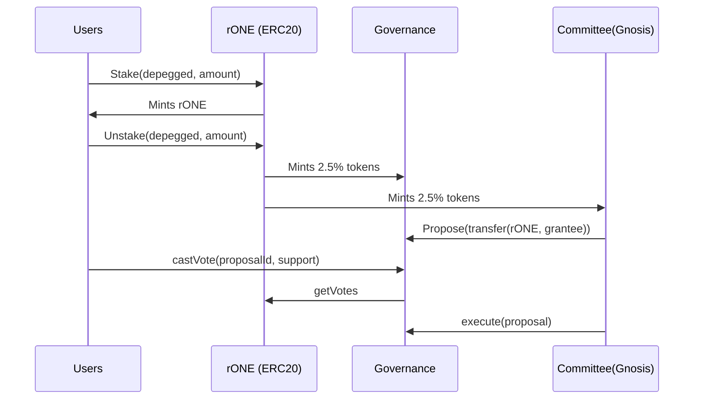
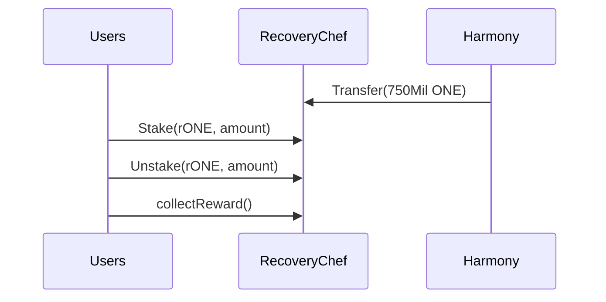
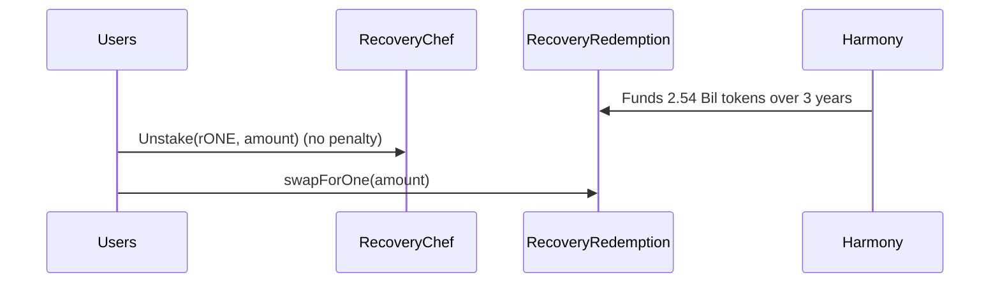

# Recovery One Governance Contracts

## Architecture

### Phase 1: Stake/Unstake Depegged Tokens

* Compound based Governance Contract (OpenZeppelin)
* Stake depegged tokens for rONE Governance token.
* Unstake token to exit the rONE.
* Able to cast vote to Governance contract
* Only committee can propose
* Governance retains 2.5% for grantee
* Committee retains 2.5% for compensation



### Phase 2: Staking/Unstake rONE

* RecoveryChef receives 750Mil ONE to pay for rewards
* Users can delegateVotes to let another address to vote on their behalf.



### Phase 3: ONE Redemption

* RecoveryRedemption receives 2.5 Bil ONE tokens over 3 year period



## How to run
```shell
npx hardhat help
npx hardhat test
GAS_REPORT=true npx hardhat test
npx hardhat node
npx hardhat run scripts/deploy.ts
```


```
quoc@quoc-linux:/mnt/fast01/governance-contracts$ npx hardhat run scripts/deploy.ts --network mainnet
Compiled 46 Solidity files successfully
RecoveryOne:  0x9De4d1267a1075E994ddc8d6bC31b9056B9b4133
Governance: 0x589ff084D31f8758614FB534a310C447A46855a9
````


## Exported votes from snapshots:

[Snapshot vote via graphql](https://hub.snapshot.org/graphql?operationName=Votes&query=%0Aquery%20Spaces%20%7B%0A%20%20spaces(%0A%20%20%20%20first%3A%2020%2C%0A%20%20%20%20skip%3A%200%2C%0A%20%20%20%20orderBy%3A%20"created"%2C%0A%20%20%20%20orderDirection%3A%20desc%0A%20%20)%20%7B%0A%20%20%20%20id%0A%20%20%20%20name%0A%20%20%20%20about%0A%20%20%20%20network%0A%20%20%20%20symbol%0A%20%20%20%20strategies%20%7B%0A%20%20%20%20%20%20name%0A%20%20%20%20%20%20network%0A%20%20%20%20%20%20params%0A%20%20%20%20%7D%0A%20%20%20%20admins%0A%20%20%20%20members%0A%20%20%20%20filters%20%7B%0A%20%20%20%20%20%20minScore%0A%20%20%20%20%20%20onlyMembers%0A%20%20%20%20%7D%0A%20%20%20%20plugins%0A%20%20%7D%0A%7D%0A%0Aquery%20Proposals%20%7B%0A%20%20proposals(%0A%20%20%20%20first%3A%2020%2C%0A%20%20%20%20skip%3A%200%2C%0A%20%20%20%20where%3A%20%7B%0A%20%20%20%20%20%20state%3A%20"closed"%2C%0A%20%20%20%20%20%20author%3A"0xf0effd4f2834402a0271d41dc62deca87b40e73b"%0A%20%20%20%20%7D%2C%0A%20%20%20%20orderBy%3A%20"created"%2C%0A%20%20%20%20orderDirection%3A%20desc%0A%20%20)%20%7B%0A%20%20%20%20id%0A%20%20%20%20title%0A%20%20%20%20body%0A%20%20%20%20choices%0A%20%20%20%20start%0A%20%20%20%20end%0A%20%20%20%20snapshot%0A%20%20%20%20state%0A%20%20%20%20author%0A%20%20%20%20space%20%7B%0A%20%20%20%20%20%20id%0A%20%20%20%20%20%20name%0A%20%20%20%20%7D%0A%20%20%7D%0A%7D%0A%0Aquery%20Votes%20%7B%0A%20%20votes%20(%0A%20%20%20%20first%3A%201000%0A%20%20%20%20where%3A%20%7B%0A%20%20%20%20%20%20proposal%3A%20"0xa42068299c4a50901160fc12a1d00785aef9a188613792d49ce8a80e0ae72d10"%0A%20%20%20%20%7D%0A%20%20)%20%7B%0A%20%20%20%20id%0A%20%20%20%20voter%0A%20%20%20%20created%0A%20%20%20%20choice%0A%20%20%20%20space%20%7B%0A%20%20%20%20%20%20id%0A%20%20%20%20%7D%0A%20%20%20%20vp%0A%20%20%7D%0A%7D%0A%0Aquery%20Follows%20%7B%0A%20%20follows%20(where%3A%20%7B%20follower%3A%20"0xeF8305E140ac520225DAf050e2f71d5fBcC543e7"%20%7D)%20%7B%0A%20%20%20%20id%0A%20%20%20%20follower%0A%20%20%20%20space%20%7B%0A%20%20%20%20%20%20id%0A%20%20%20%20%7D%0A%20%20%20%20created%0A%20%20%7D%0A%7D%0A)