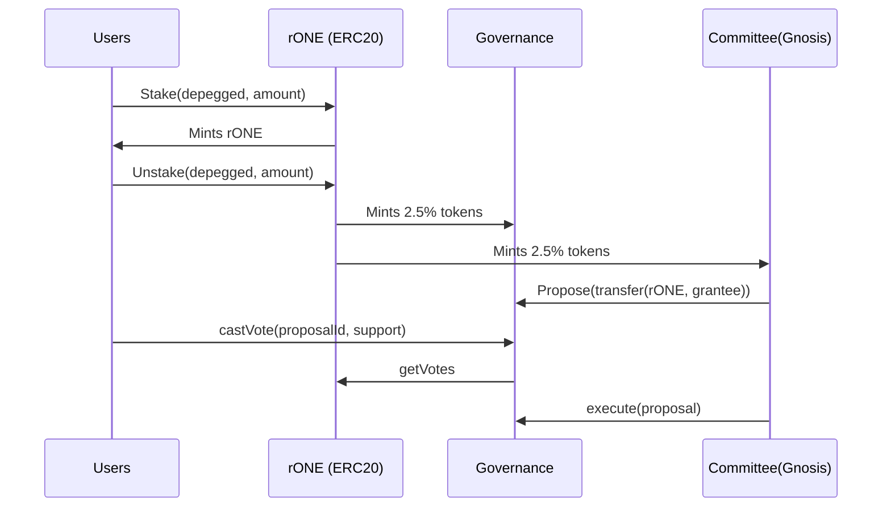
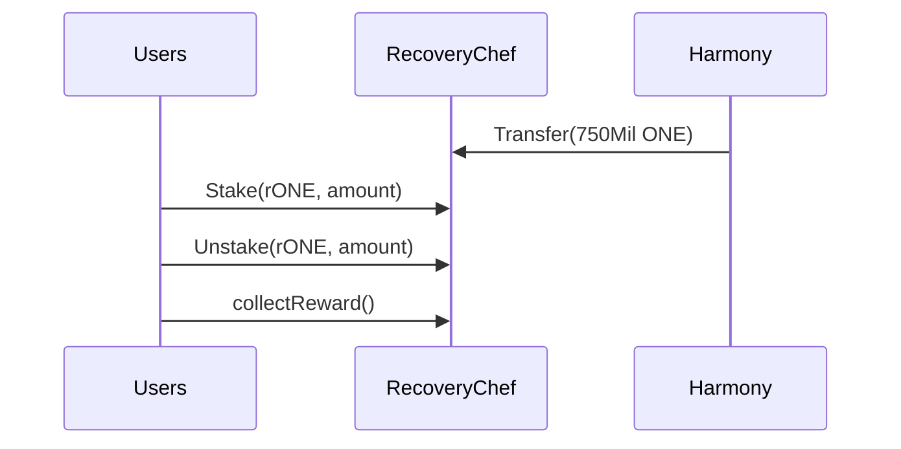
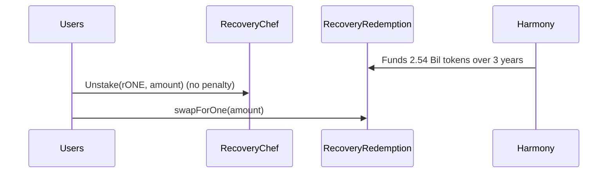

# Recovery One Governance Contracts

## Architecture

### Phase 1: Stake/Unstake Depegged Tokens

* Compound based Governance Contract (OpenZeppelin)
* Stake depegged tokens for rONE Governance token.
* Unstake token to exit the rONE.
* Able to cast vote to Governance contract
* Only committee can propose
* Governance retains 2.5% for grantee
* Committee retains 2.5% for compensation



### Phase 2: Staking/Unstake rONE

* RecoveryChef receives 750Mil ONE to pay for rewards
* Users can delegateVotes to let another address to vote on their behalf.



### Phase 3: ONE Redemption

* RecoveryRedemption receives 2.5 Bil ONE tokens over 3 year period



## How to run
```shell
npx hardhat help
npx hardhat test
GAS_REPORT=true npx hardhat test
npx hardhat node
npx hardhat run scripts/deploy.ts
```
